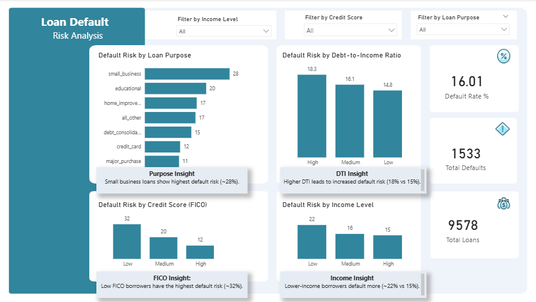

# Loan-Default-Risk-Analysis
Analyzing loan data to identify default risk patterns and key factors influencing borrower behavior using SQL and Power BI.

## 📊 Overview
This project analyzes loan data to identify factors that influence loan default risk.

## 🛠 Tools Used
- PostgreSQL (Data Cleaning & Analysis)
- Excel (Exploration)
- Power BI (Dashboard)

## 🎯 Objective
To identify high-risk borrowers and provide data-driven insights for better lending decisions.

## 📁 Dataset
Real-world loan dataset with 9,000+ records including borrower financial and credit information.

Explore the full interactive dashboard:👉 [Download Power BI File](powerbi/loan_analysis.pbix)

## 🔍 Key Analysis Areas
- Default rate analysis
- Credit score impact
- Income vs loan repayment
- Risk segmentation

## 📈 Key Insights
- The overall loan default rate is approximately 16.23%, indicating a moderate level of credit risk across the portfolio.
- Borrowers with low credit scores (FICO < 650) have the highest default rate at approximately 32%, compared to 20% for medium and 12% for high credit score borrowers.
- Borrowers with high debt-to-income ratios show higher default rates (18.32%) compared to medium (16.11%) and low (14.83%), highlighting financial burden as a key risk factor.
- Loan purpose influences default risk, with small business loans showing the highest default rate (~28%), followed by educational loans (~20%), suggesting higher uncertainty in these categories.
- Lower-income borrowers exhibit higher default rates (~22%) compared to medium (~16%) and high-income (~15%) groups, indicating income level significantly impacts repayment ability.

## 📸 Dashboard Preview

 

 

## 🧠 Skills Demonstrated
- Data Cleaning using SQL
- Feature Engineering (default_flag creation)
- Data Analysis & Aggregation
- Business Insight Generation
- Data Storytelling

## 📊 Next Steps
- Build interactive dashboard in Power BI
- Visualize default risk trends
- Create KPI metrics for business decision-making

## ✅ Conclusion

This project provided valuable insights into the key factors influencing loan default risk, including credit score, income level, debt-to-income ratio, and loan purpose.

Through this analysis, I demonstrated the ability to transform raw data into meaningful business insights using SQL, Excel, and Power BI. The interactive dashboard further highlights how data can support informed decision-making in financial risk assessment.

This project reflects my growing expertise in data analytics, particularly in data cleaning, analysis, and storytelling.

Developed by: Giwa Aaron Babatunde

Role: Aspiring Data Analyst | Open to Opportunities

GitHub: https://github.com/giwa-data-analyst
